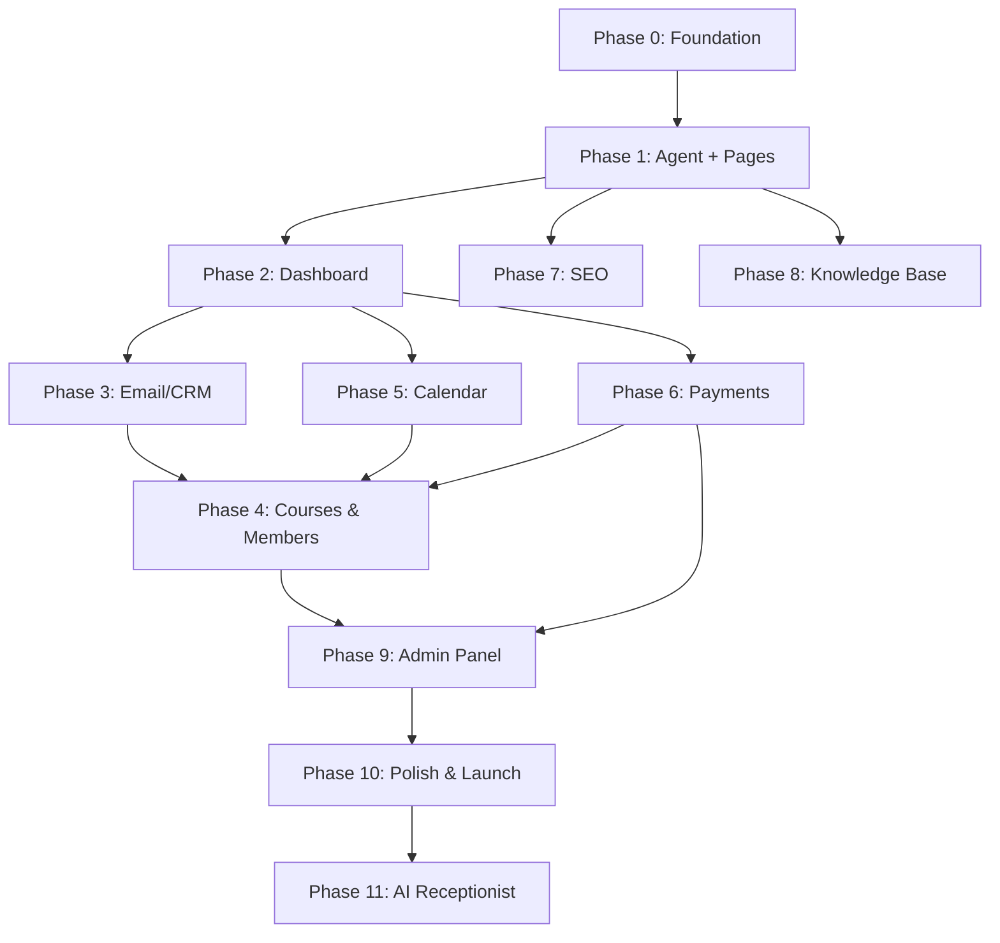

# AgentBloom — Phase Breakdown Master Plan

> Each phase is a complete, deployable increment. If development pauses, any AI/developer can pick up from the current phase. Each phase has its own detailed document.

## Phase Overview

| Phase | Name | Focus | Est. Duration | Status |
|-------|------|-------|---------------|--------|
| 0 | Foundation | Infra, auth, DB, project scaffold | 2-3 weeks | NOT STARTED |
| 1 | Core Agent + Page Builder | AI agent loop, template system, basic page generation | 4-5 weeks | NOT STARTED |
| 2 | Dashboard + Visual Editor | Full dashboard UI, manual editing, media library | 3-4 weeks | NOT STARTED |
| 3 | Email / CRM | Email builder, sequences, automations, SES setup | 3-4 weeks | NOT STARTED |
| 4 | Courses & Memberships | Course builder, video hosting, member portal, paywalls | 4-5 weeks | NOT STARTED |
| 5 | Calendar & Booking | Booking system, public pages, Google Calendar sync | 2-3 weeks | NOT STARTED |
| 6 | Payments & Billing | Stripe Connect, checkout, subscriptions, invoices | 3-4 weeks | NOT STARTED |
| 7 | SEO Engine | Auto-SEO, sitemap, audit, local SEO, schema | 2-3 weeks | NOT STARTED |
| 8 | Knowledge Base | Upload pipeline, processing, vector storage, search | 2-3 weeks | NOT STARTED |
| 9 | Admin Panel | User management, analytics, moderation, system health | 2-3 weeks | NOT STARTED |
| 10 | Polish & Launch | Testing, performance, accessibility, onboarding wizard | 2-3 weeks | NOT STARTED |
| 11 | AI Receptionist | Voice/SMS/chat, Twilio, training interface (add-on) | 4-5 weeks | NOT STARTED |

**Total estimated: 32-43 developer-weeks** (one experienced full-stack dev; parallelizable with 2-3 devs)

## Critical Path
```
Phase 0 (Foundation) 
  → Phase 1 (Agent + Pages) — core value prop
    → Phase 2 (Dashboard) — user interaction layer
      → Phase 3 (Email) + Phase 5 (Calendar) — can run in parallel
        → Phase 4 (Courses) + Phase 6 (Payments) — can run in parallel
          → Phase 7 (SEO) + Phase 8 (KB) — can run in parallel
            → Phase 9 (Admin)
              → Phase 10 (Polish)
                → Phase 11 (Receptionist) — add-on, last
```

## Phase Dependencies


## Handoff Protocol
When pausing/resuming development:
1. Check this master plan for current phase status
2. Read the specific phase document (e.g., `02-PHASE-1-AGENT.md`)
3. Check `CHANGELOG.md` for recent changes
4. Run `npm run dev` to verify current state builds
5. Check GitHub issues for any open bugs/tasks
6. Continue from where the previous developer left off

## Tech Stack Summary
- **Backend**: Django 5.x (LTS) + Django Channels + Django REST Framework
- **Frontend**: Next.js 15+ App Router + Tailwind CSS + shadcn/ui
- **Database**: Amazon RDS PostgreSQL 16 + pgvector extension
- **Cache**: Amazon ElastiCache Redis
- **Auth**: Django allauth (Google OAuth, magic links, email/password)
- **File Storage**: Amazon S3
- **CDN**: Amazon CloudFront
- **DNS**: Amazon Route 53
- **Email**: Amazon SES (custom domains, DKIM/SPF)
- **LLM**: GPT-4o (primary), Claude 4.6 (fallback), Gemini 3.2 Pro (design tasks)
- **Vector Search**: pgvector in PostgreSQL
- **Real-time**: Django Channels + Redis (WebSocket)
- **Hosting**: AWS Lightsail (Phase 0-2), migrate to ECS/EC2 at scale
- **CI/CD**: GitHub Actions
- **Monitoring**: CloudWatch + Sentry
