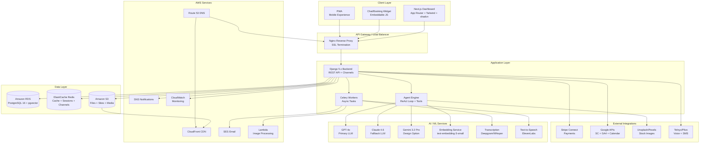

# AgentBloom — System Architecture

## High-Level Architecture



## Component Architecture

### Frontend (Next.js 15+)
```
┌──────────────────────────────────────────────────────────┐
│                    Next.js App Router                      │
├──────────────┬───────────────┬────────────────────────────┤
│  Auth Pages  │  Dashboard    │  Public Pages              │
│  - Login     │  - Home       │  - Booking Page            │
│  - Register  │  - Builder    │  - Course Player           │
│  - Magic Link│  - Email/CRM  │  - Member Portal           │
│              │  - Courses    │  - Generated Sites         │
│              │  - Calendar   │  - Widget (Chat/Booking)   │
│              │  - Payments   │                            │
│              │  - KB         │                            │
│              │  - Settings   │                            │
│              │  - Admin      │                            │
├──────────────┴───────────────┴────────────────────────────┤
│  Shared: Agent Widget | Notifications | Command Palette   │
├──────────────────────────────────────────────────────────┤
│  UI Library: shadcn/ui + Tailwind + Custom Components     │
├──────────────────────────────────────────────────────────┤
│  State: React Context + TanStack Query (server state)     │
├──────────────────────────────────────────────────────────┤
│  Real-time: WebSocket Client (Agent Streaming)            │
└──────────────────────────────────────────────────────────┘
```

### Backend (Django 5.x)
```
┌──────────────────────────────────────────────────────────┐
│                    Django Application                      │
├──────────────────────────────────────────────────────────┤
│                     API Router (DRF)                       │
│  /api/v1/auth/    /api/v1/sites/    /api/v1/agent/       │
│  /api/v1/pages/   /api/v1/email/    /api/v1/courses/     │
│  /api/v1/calendar/ /api/v1/payments/ /api/v1/kb/         │
│  /api/v1/admin/                                           │
├──────────────────────────────────────────────────────────┤
│                  Django Channels (WebSocket)               │
│  /ws/agent/{org_id}/     Agent Chat Streaming             │
│  /ws/notifications/      Real-time Notifications          │
├──────────────────────────────────────────────────────────┤
│                    Django Apps                             │
│  ┌──────────┐ ┌──────────┐ ┌──────────┐ ┌──────────┐    │
│  │  users   │ │  sites   │ │  agent   │ │  email   │    │
│  │  auth    │ │  pages   │ │  tools   │ │  crm     │    │
│  │  orgs    │ │  templates│ │  memory  │ │  campaigns│   │
│  └──────────┘ └──────────┘ └──────────┘ └──────────┘    │
│  ┌──────────┐ ┌──────────┐ ┌──────────┐ ┌──────────┐    │
│  │ courses  │ │ calendar │ │ payments │ │    kb    │    │
│  │ members  │ │ bookings │ │  stripe  │ │ vectors  │    │
│  │ community│ │ events   │ │ invoices │ │ uploads  │    │
│  └──────────┘ └──────────┘ └──────────┘ └──────────┘    │
│  ┌──────────┐ ┌──────────┐                               │
│  │   seo    │ │  admin   │                               │
│  │  schema  │ │  flags   │                               │
│  │  audit   │ │ moderate │                               │
│  └──────────┘ └──────────┘                               │
├──────────────────────────────────────────────────────────┤
│               Celery Task Queue (Redis)                    │
│  - Email sending    - Transcription    - Image processing │
│  - KB embedding     - SEO audits       - Scheduled tasks  │
│  - Video processing - Report generation                   │
└──────────────────────────────────────────────────────────┘
```

### Agent Architecture
```
┌──────────────────────────────────────────────────────────┐
│                    Agent Engine                            │
├──────────────────────────────────────────────────────────┤
│                                                           │
│   User Input (text/voice)                                │
│         │                                                 │
│         ▼                                                 │
│   ┌─────────────┐                                        │
│   │ Preprocessor │ ── Voice? → STT (Deepgram)            │
│   └──────┬──────┘                                        │
│          ▼                                                │
│   ┌─────────────────┐                                    │
│   │ Context Builder  │ ── Load: user prefs, KB chunks,   │
│   │                  │    conversation history, site data │
│   └──────┬──────────┘                                    │
│          ▼                                                │
│   ┌─────────────────┐    ┌───────────────┐               │
│   │  LLM Reasoning  │◄──►│ Tool Registry │               │
│   │  (ReAct Loop)   │    │ 40+ tools     │               │
│   └──────┬──────────┘    └───────────────┘               │
│          │                                                │
│          ├── Confident? ──► Execute Tool                  │
│          │                     │                          │
│          │                     ▼                          │
│          │              Observe Result                    │
│          │                     │                          │
│          │                     ▼                          │
│          │              More steps? ──► Loop back         │
│          │                                                │
│          ├── Uncertain? ──► Ask Clarification             │
│          │                                                │
│          └── Complete? ──► Stream Response                │
│                              │                            │
│                              ▼                            │
│                    ┌──────────────┐                       │
│                    │ Preview/Approve│ (if destructive)    │
│                    └──────┬───────┘                       │
│                           ▼                               │
│                    Deploy / Execute                       │
│                                                           │
├──────────────────────────────────────────────────────────┤
│  Supporting Systems:                                      │
│  - Prompt Cache (Redis)     - Token Budget Tracker        │
│  - Conversation Memory (DB) - Action Audit Log            │
│  - Scheduled Task Runner    - Model Failover Chain        │
└──────────────────────────────────────────────────────────┘
```

## Data Flow Diagrams

### Page Generation Flow
```
User: "Build an HVAC landing page"
  │
  ▼
Agent: Parse intent → page_type=landing, niche=hvac
  │
  ▼
Agent: search KB → find HVAC-related content
  │
  ▼
Agent: select_template → HVAC template
  │
  ▼
Agent: generate_copy → headlines, body, CTAs (from KB + LLM)
  │
  ▼
Agent: fetch_stock_images → HVAC-related photos from Unsplash
  │
  ▼
Agent: generate_testimonials → from KB or LLM-generated
  │
  ▼
Agent: build_pricing_table → from KB pricing info
  │
  ▼
Agent: assemble_page → combine all blocks into page JSON
  │
  ▼
Agent: preview_page → generate preview URL
  │
  ▼
User: Reviews preview → Approves
  │
  ▼
Agent: deploy_page → render HTML → upload to S3 → invalidate CDN
  │
  ▼
Page live at: hvacbusiness.com/emergency-repair
```

### Email Campaign Flow
```
User: "Send a newsletter to all active subscribers"
  │
  ▼
Agent: Identify segment (all active contacts)
  │
  ▼
Agent: Generate email content (from KB + recent activity)
  │
  ▼
Agent: Apply email template
  │
  ▼
Agent: Preview → User approves
  │
  ▼
Celery: Queue email batch
  │
  ▼
SES: Send from user@customdomain.com (DKIM signed)
  │
  ▼
Webhooks: Track delivery, opens, clicks
  │
  ▼
Dashboard: Update campaign analytics
```

## Security Architecture
```
┌─────────────────────────────────────────────┐
│              Security Layers                 │
├─────────────────────────────────────────────┤
│ 1. HTTPS (SSL/TLS via Let's Encrypt)        │
│ 2. Nginx rate limiting (100 req/min/IP)      │
│ 3. Django CSRF protection                    │
│ 4. JWT auth tokens (short-lived + refresh)   │
│ 5. Row-level security (org_id filtering)     │
│ 6. S3 bucket policies (per-org isolation)    │
│ 7. Input sanitization (bleach + DOMPurify)   │
│ 8. Agent output preview before deploy        │
│ 9. Audit logging (all mutations)             │
│ 10. GDPR: consent tracking, data export/del  │
└─────────────────────────────────────────────┘
```

## Multi-Tenant Data Isolation
```
Every query includes org_id filter:
  SELECT * FROM pages WHERE org_id = :current_org_id AND ...

S3 structure:
  s3://agentbloom-assets/
    ├── orgs/
    │   ├── {org-uuid-1}/
    │   │   ├── media/
    │   │   ├── sites/
    │   │   ├── courses/
    │   │   └── kb-docs/
    │   ├── {org-uuid-2}/
    │   │   └── ...

Django middleware automatically sets org context:
  request.org = get_org_from_request(request)
  All querysets filtered: Model.objects.for_org(request.org)
```
